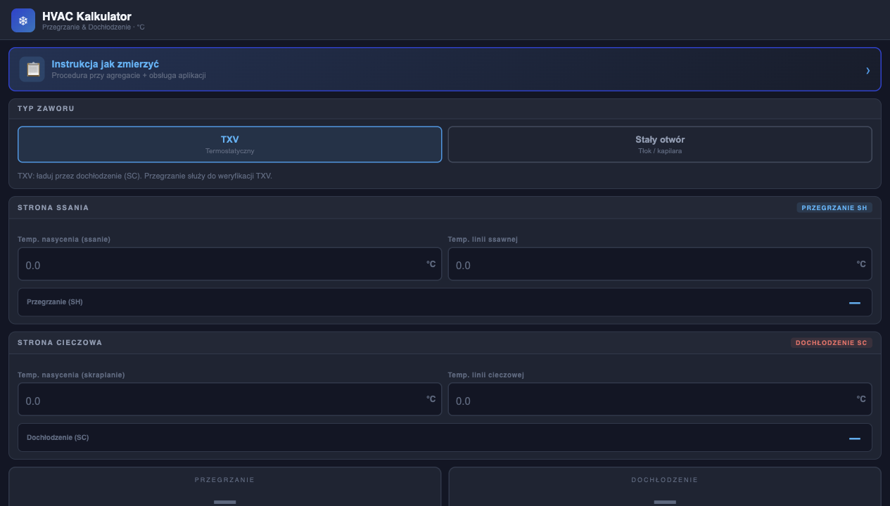

# HVAC Kalkulator SH & SC

Mobilny kalkulator serwisowy do szybkiego obliczania przegrzania (SH) i dochłodzenia (SC) w układach klimatyzacji oraz pomp ciepła. Projekt jest statyczną aplikacją PWA przygotowaną z myślą o pracy przy agregacie: szybko się uruchamia, działa w przeglądarce i nie wymaga backendu.



## Co potrafi

- oblicza przegrzanie SH na podstawie temperatury nasycenia ssania i temperatury linii ssawnej,
- oblicza dochłodzenie SC na podstawie temperatury nasycenia skraplania i temperatury linii cieczowej,
- pozwala wybrać typ zaworu: TXV albo stały otwór / tłok / kapilara,
- automatycznie dopasowuje zakresy docelowe do wybranego typu układu,
- pokazuje kolorową interpretację wyniku: norma, odchylenie albo stan krytyczny,
- generuje prostą diagnozę na podstawie kombinacji SH i SC,
- zawiera instrukcję pomiarów przy agregacie,
- działa jako lekka aplikacja PWA na telefonie.

## Podgląd instrukcji


## Dla kogo

Projekt jest przeznaczony dla osób zajmujących się serwisem HVAC, klimatyzacją i pompami ciepła. Sprawdza się jako szybka pomoc przy kontroli pracy układu, doborze kierunku diagnozy oraz przypomnieniu procedury pomiaru.

## Zasada działania

Kalkulator korzysta z dwóch podstawowych wzorów:

```text
SH = temperatura linii ssawnej - temperatura nasycenia ssania
SC = temperatura nasycenia skraplania - temperatura linii cieczowej
```

Dla zaworu TXV aplikacja sugeruje kontrolę ładowania przez dochłodzenie (SC), a dla układu ze stałym otworem przez przegrzanie (SH).

## Zakresy referencyjne

| Typ układu | Przegrzanie SH | Dochłodzenie SC | Główna metoda kontroli |
| --- | ---: | ---: | --- |
| TXV | 5-8 °C | 5-10 °C | SC |
| Stały otwór / tłok / kapilara | 8-12 °C | 5-10 °C | SH |

Wartości należy traktować jako pomoc serwisową. Ostateczna ocena powinna uwzględniać dokumentację producenta, warunki pracy układu, temperaturę zewnętrzną, przepływ powietrza i typ czynnika.

## Uruchomienie lokalnie

Projekt nie wymaga instalowania zależności.

```bash
git clone git@github.com:MatteoBarzotto/hvac-kalkulator.git
cd hvac-kalkulator
python3 -m http.server 4173
```

Następnie otwórz:

```text
http://127.0.0.1:4173/
```

Można też otworzyć plik `index.html` bezpośrednio w przeglądarce.

## Instalacja jako PWA

Aplikacja zawiera plik `manifest.json`, więc na telefonie można dodać ją do ekranu głównego:

1. Otwórz stronę w przeglądarce mobilnej.
2. Wybierz opcję udostępniania lub menu przeglądarki.
3. Kliknij `Dodaj do ekranu początkowego`.

Po instalacji kalkulator uruchamia się jak osobna aplikacja.

## Struktura projektu

```text
.
├── index.html
├── manifest.json
└── docs/
    └── screenshots/
```

## Technologie

- HTML5
- CSS3
- JavaScript
- Progressive Web App

## Status

Projekt jest lekki, statyczny i gotowy do hostowania np. przez GitHub Pages, Netlify, Vercel albo dowolny serwer plików statycznych.

## Autor

Projekt stworzony jako praktyczne narzędzie pomocnicze dla pracy serwisowej HVAC.
